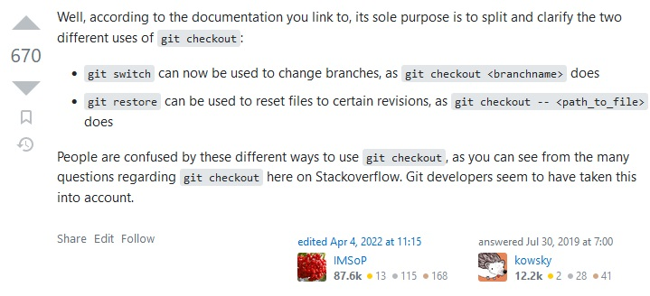

#Git checkout vs git switch / git restore

 **1. Git checkout**
    

La commande “git checkout” permet la bascule sur une autre branche ou de restaurer des fichiers de l’arbre actuel.
Il existe trois commandes principales pour ces actions :

-   “git checkout <branchname>” pour basculer d’une branche à une autre.
-   “git checkout –b <branchname>" pour créer une branche et basculer dessus.
-   “git checkout -- <path_to_file>” pour restaurer un ou plusieurs fichiers qui ne sont pas staged sans changer de branche.
    

**2.  **Git switch et git restore****
    

Git a introduit deux nouvelles commandes lors de la maj 2.23 :
-   “git switch” pour basculer d’une branche à une autre.
	-   “git switch <branchname> pour basculer sur une branche existante. 
	-   “git switch -c <branchname> pour créer une nouvelle branche et basculer dessus.
	-   “git switch -” pour revenir sur la branche extraite précédemment.
    

-   “git restore” pour restaurer un ou plusieurs fichiers.
	-   “git restore --source" pour spécifier ce que l’on veut copier.
	-   “git restore --stage" et “git restore --worktree" pour spécifier la destination.
    

**3.  Pourquoi avoir implanté git switch alors que git checkout le faisait déjà ?**

    

Les commandes “git  checkout <branchname> et ” “git checkout -- <path_to_file>” avaient tendance à rendre confus les utilisateurs, aussi bien les novices que les plus expérimentés, car ces deux fonctionnalités sont totalement différentes, notamment si l’on travaille sur un fichier et une branche du même nom.
 

Pour remédier à cela et rendre les commandes plus claires et concises sur l’interface, Git a donc introduit le 16 aout 2019 les commandes “git switch” et “git restore”. La commande “git checkout” était considérée trop “couteau suisse” avec des sous commandes sans rapports.

Voici un tableau comparatif des commandes “git  checkout” et “git switch"

Sources

[https://github.blog/2019-08-16-highlights-from-git-2-23/](https://github.blog/2019-08-16-highlights-from-git-2-23/)

https://www.infoq.com/news/2019/08/git-2-23-switch-restore/

[https://stackoverflow.com/questions/57265785/whats-the-difference-between-git-switch-and-git-checkout-branch](https://stackoverflow.com/questions/57265785/whats-the-difference-between-git-switch-and-git-checkout-branch)

https://www.scaler.com/topics/git/git-switch-vs-checkout/
